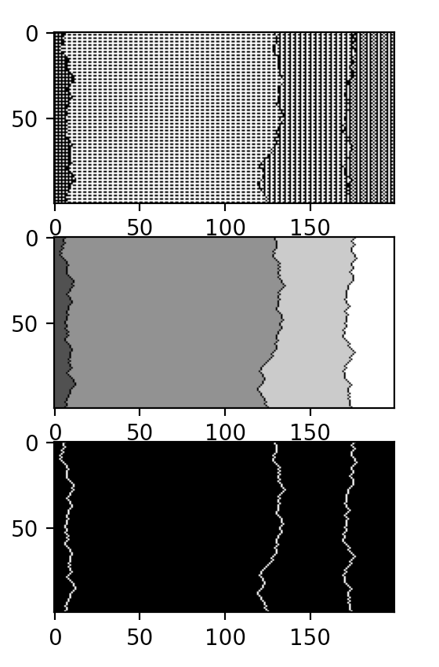

# DomainDefectDataset
A dataset of hand-annotated emergent domain defects in 1D elementary cellular automata to benchmark test (or train) automated detection algorithms


## example

A random sample
```python
python synthetic_data_generator.py 
```

More control?
```python
python synthetic_data_generator.py --space 100 --time 200 --max_phase 3 --n_domains 3 
```


Specify the exact patterns and locations of each domain
```python
python synthetic_data_generator.py --domain_pattern 1 0 --domain_pattern 0 1 --domain_centre 10 10 --domain_centre 50 50  
```

Create a dataset for testing
```python
python synthetic_data_generator.py --samples 500 --no-display 
```

Stochastic Defects
```python
python synthetic_data_generator.py --stochastic_defects 3
```


## Todo:
[X] stochastic defects
- Add complex domains
- Add chaotic domains
- Save annotations as b64 strings
- Defects with different widths (and patterns of their own)
- Generator can syntesise complex examples by specifying patterns with long periods and long phases
