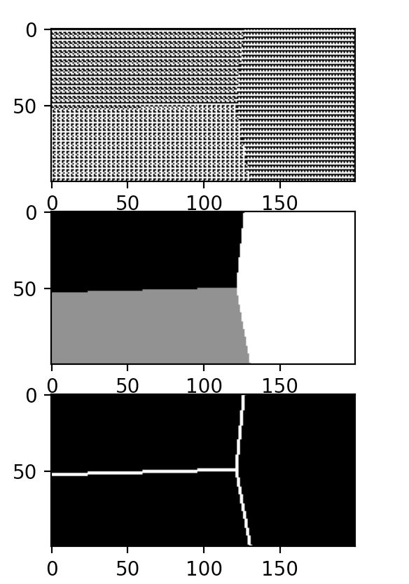

# DomainDefectDataset
A dataset of hand-annotated emergent domain defects in 1D elementary cellular automata to benchmark test (or train) automated detection algorithms


## example

A random sample
```python
python synthetic_data_generator.py 
```

More control?
```python
python synthetic_data_generator.py --space 100 --time 200 --max_phase 3 --n_domains 3 
```


Specify the exact patterns and locations of each domain
```python
python synthetic_data_generator.py --domain_pattern 1 0 --domain_pattern 0 1 --domain_centre 10 10 --domain_centre 50 50  
```

Create a dataset for testing
```python
python synthetic_data_generator.py --samples 500 --no-display 
```

## Todo:
- stochastic defects
- chaotic domain patterns